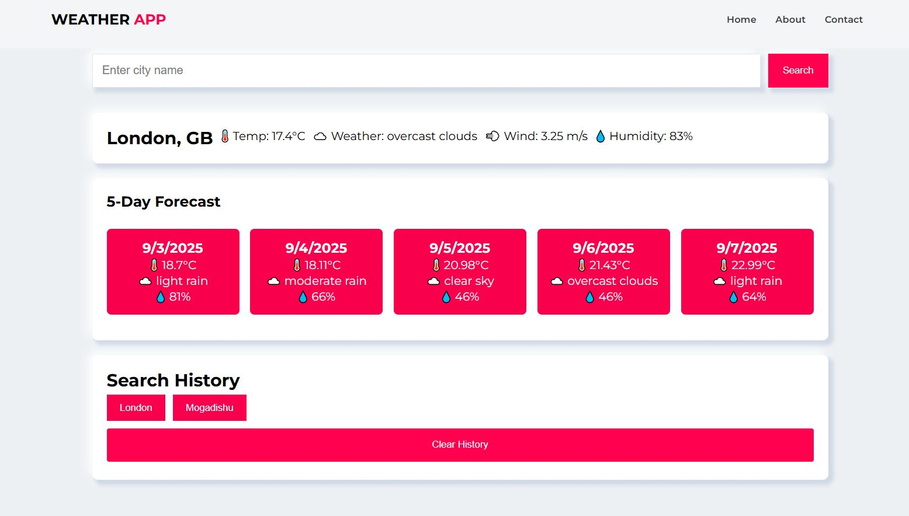

# 🌤️ Weather App

Weather App waa web app fudud oo ku siinaya xogta cimilada maanta iyo 5 maalmood ee soo socda, adigoo isticmaalaya **OpenWeatherMap API**.  

Mashruucan waxaa loo sameeyay in lagu barto:
- JavaScript (fetch API, DOM manipulation)
- APIs & JSON handling
- localStorage (search history save)
- HTML & CSS (UI design)

---

## 🚀 Features
- ✅ Soo bandhig cimilada maanta (temperature, humidity, wind speed, iwm)  
- ✅ 5-Day forecast (faahfaahin maalin kasta)  
- ✅ Search history lagu keydiyo `localStorage`  
- ✅ Responsive design ku shaqeynaya PC iyo Mobile  

---

## 🛠️ Tech Stack
- **HTML5** – structure  
- **CSS3** – styling  
- **JavaScript (ES6)** – logic & API integration  
- **OpenWeatherMap API** – weather data source  

---

## Bedel API key (file-ka script.js):
1. file-ka script.js:
   ```bash
   const API_KEY = "YOUR_API_KEY_HERE";
---


## 📸 Screenshots

### Before Search


### After Searching Result


---

## 📥 Installation & Setup

1. Clone repo-ga:

   ```bash
   git clone https://github.com/engisak/weather-App
   cd weather-App